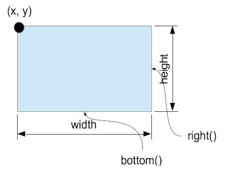
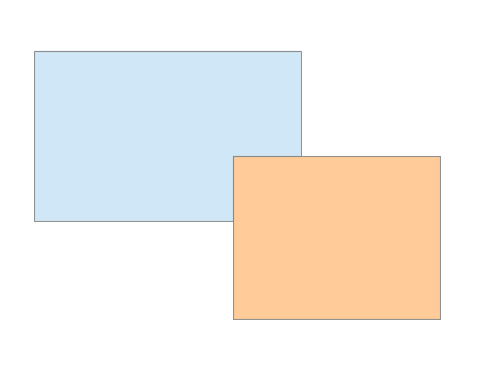
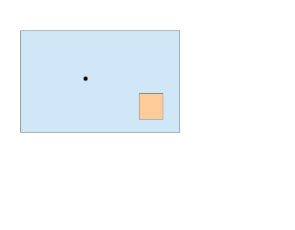

# Rect
Operations on rectangles with integer coordinates.

## Coordinate system and attribute values
The origin of the coordinate system is assumed to be in the upper-left. The X axis increases to the right and the Y axis increases down. This results in the attributes, "left", "right", "top", and "bottom" having the expected meaning. Mathematically, any coordinate system is valid with the understanding that left <= right and top <= bottom. 

While the origin of the rectangle can be anywhere, the width and height are always assumed to be non-negative. 

## Attributes

### overlaps()

### contains()

## Operations
### include()

### clip()

