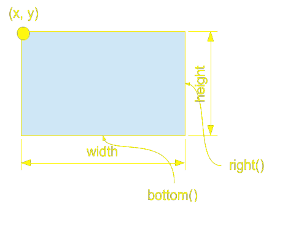
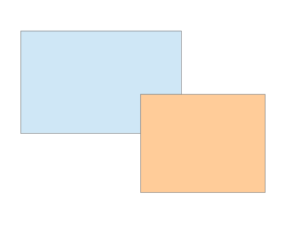
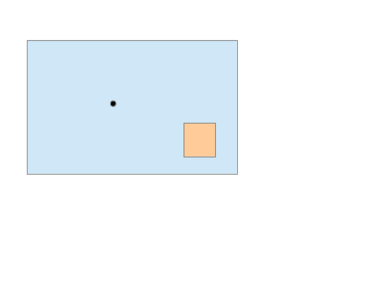
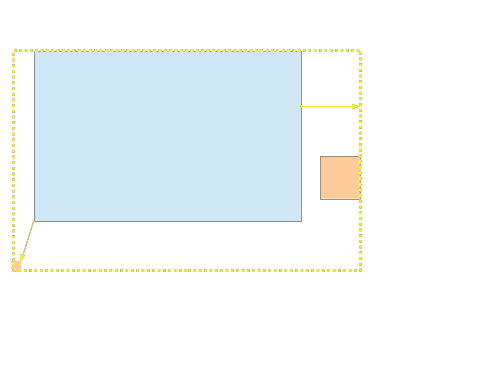
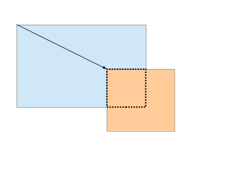

# Rect

[](https://github.com/jambolo/Rect/actions/workflows/ci.yml)
[](https://codecov.io/gh/jambolo/Rect)

Operations on rectangles with integer coordinates.

## Quick Start

### Build
```bash
cmake -B build
cmake --build build
```

### Test
```bash
cmake -B build -DBUILD_TESTING=ON
cmake --build build
ctest --test-dir build --output-on-failure
```

### Install
```bash
cmake --install build --prefix <install-path>
```

### Use in Your Project
```cmake
find_package(Rect REQUIRED CONFIG)
target_link_libraries(your-target PRIVATE Rect::Rect)
```

### Documentation (Optional)
```bash
cmake -B build -DRECT_BUILD_DOCS=ON
cmake --build build --target doxygen
# Output in build/docs/
```

## Requirements
- CMake 3.23 or later
- C++17 compatible compiler

## Coordinate system and attribute values
The origin of the coordinate system is assumed to be in the upper-left. The X axis increases to the right and the Y axis increases down. This results in the attributes, "left", "right", "top", and "bottom" having the expected meaning. Mathematically, any coordinate system is valid with the understanding that left <= right and top <= bottom. 

While the origin of the rectangle can be anywhere, the width and height are always assumed to be non-negative. 

### Half-Inclusive Ranges
**Important:** Rectangles use half-inclusive ranges for both horizontal and vertical extents:
- **Horizontal**: `[x, x+width)` — the left edge is **inclusive**, the right edge is **exclusive**
- **Vertical**: `[y, y+height)` — the top edge is **inclusive**, the bottom edge is **exclusive**

This means:
- A point at `(x, y)` is inside the rectangle
- A point at `(x+width, y)` or `(x, y+height)` is outside the rectangle  
- Two rectangles that share only an edge (e.g., `rect1.right() == rect2.x`) do not overlap

Example:
```cpp
Rect r = {5, 6, 4, 3};  // x=5, y=6, width=4, height=3
// Contains points in range [5,9) × [6,9)
r.contains(5, 6);  // true  - top-left corner included
r.contains(8, 8);  // true  - interior point
r.contains(9, 8);  // false - x=9 is the right edge (excluded)
r.contains(8, 9);  // false - y=9 is the bottom edge (excluded)
```

## Attributes



## Relations

|          overlaps()         |          contains()         |
| --------------------------- | --------------------------- |
|  |  |

## Operations

|          include()          |          clip()         |
| --------------------------- | ----------------------- |
|    |      |
